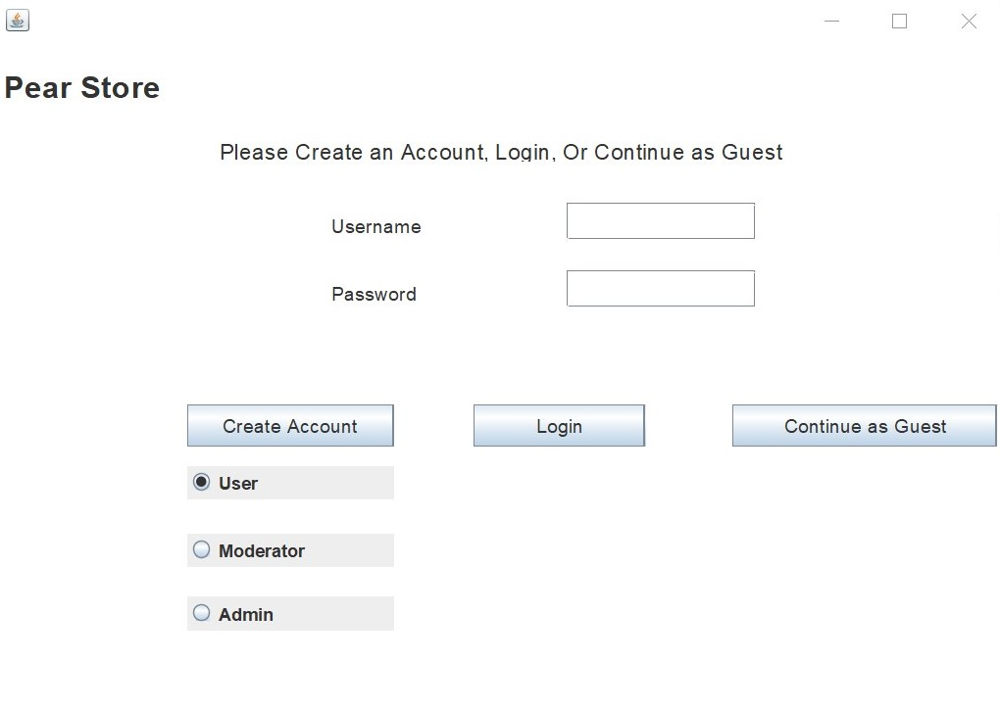
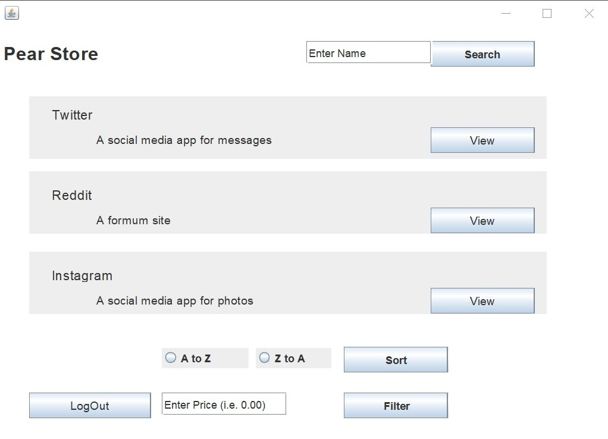

# CSE201_Pear

### User Documentation

This GitHub repository is an in-progress application Repository showing a filterable and sortable library of applications based on different criteria - built fully in Java. Users can create accounts and login to them, view discussion boards on mobile and desktop applications, post comments, and compare through different platforms. Different filters and views can be used to aggregate different application information.

On the front page, a user can either continue as a guest, which would allow for basic functionalities. However, if they create an account and login, they can access other features. 



A user can then sort from A-Z or Z-A by setting such option and then clicking Sort. They can also filter by setting a price at the left input field. Clicking on LogOut sends a user back to the home screen.



## Developer Documentation

After cloning the repository, running the ANT build script should automatically clean, compile and build the JAR file for the program. If you do not want to clone it, you can download it as a ZIP file, import it into your IDE, and run the build script. This will clean, compile, and overall correctly build the project. 

- Cleaning the file directory fixes any classpath issues
- A new directory structure is added for future testing and for packaging all of the software resources pre-compilation
- Compilation and packaging of the corresponding JAR files is followed therafter
- Running the program driver

It is important to note that you must run the **run** target first so that all the steps can be properly followed. You could run each target individually as well.

```xml
	<!--Cleans the directory structure -->
	<target name="clean" description="Cleans directories">
		<delete dir="bin" />
		<delete dir="dist" />
		<delete dir="test" />
		<echo message="${ant.project.name}: Directory structure cleaned" />
	</target>
	
	<!--Builds destination directories before compiling the classes -->
	 <target name="init" depends="clean" description="Builds destination directories">
	 	<echo message="${ant.project.name}: ${ant.file}"/>
	 	<mkdir dir="bin/main" />
	 	<mkdir dir="dist" />
	 	<mkdir dir="test" />
	 	<echo message="${ant.project.name}: Directory structure added" />
	  </target>
		
	<!--Compiles the main package of core Java classes-->
	  <target name="compile" depends="init" description="Compile Java code">
	    <javac srcdir="src/main" destdir="bin" includeantruntime="false" />
	  	<echo message="${ant.project.name}: Compilation completed"/>
	  </target>
	
	<!--Builds a JAR package for developer use; contains all compiled classes-->
	 <target name="package" depends="compile" description="Generates the JAR file">
	    <jar destfile="dist/CSE201_Pear.jar" basedir="bin">
	    	<manifest>
	    		<section name="main/PearWindow.class">
	    		    <attribute name="Sealed" value="false"/>
	   			</section>
	    	</manifest>
	    </jar>
	 	<echo message="${ant.project.name}: JAR file generated"/>
	  </target>
	
	<!-- Runs the program -->
	<target name="run" depends="package" description="Runs the program">
		<echo message="${ant.project.name}: Running program"/>
		<java sourcefile="main.PearWindow" fork="true">
			<classpath>
				<pathelement path="bin"/>
			</classpath>
		</java>
	</target>
```

To add dependencies with ANT:

```xml
<target name="package" depends="compile" description="Generates the JAR file">                                                
    <jar destfile="dist/CSE201_Pear.jar" basedir="bin"/>
    //Future dependencies using JAR files added here
    <echo message="${ant.project.name}: JAR file generated"/>
</target>
```
To conduct tests, adding JUnit to your corresponding classpath allows for testing. A test directory is created to store tester classes. Adding a JUnit JAR file as a dependency inside the package target would allow for JUnit tests to be run. Otherwise, you can just add it to you current classpath in your IDE (Select the project > Configure Build Path > Add Library > JUnit4 (or 5) .

## Project Features
Our Trello board can be found [here](https://trello.com/b/LYVkS7HJ/pear), alongside project reports and other links.
